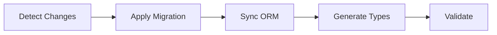

# HIL (Human-in-the-Loop) Development Methodology

> **Agent-Enhanced Software Development with Intelligent Automation**  
> A complete development lifecycle from requirements to deployment with specialized AI agents

## Overview

The HIL methodology combines human expertise with AI agent capabilities to create an efficient, safe, and scalable development workflow. Each phase integrates specialized agents that handle routine tasks while maintaining human oversight at critical decision points.

## Core Principles

### 1. Confidence-Based Automation
- Actions are executed based on confidence scores (30-100%)
- Higher confidence = more automation
- Critical operations always require human approval

### 2. Specialized Expertise
- 5 specialized agents handle different domains
- Each agent has specific capabilities and confidence patterns
- Agents can coordinate for complex tasks

### 3. Progressive Enhancement
- Start with analysis-only mode
- Graduate to interactive approval
- Move to automated execution as confidence grows

## The 7-Phase HIL Workflow

### Phase 1: Requirements & Specification
**Command**: `/create-spec [feature-description]`

**Process**:
1. Analyze product vision and roadmap
2. Gather requirements through structured questions
3. Generate comprehensive specification documents
4. Create technical implementation details

**Output**:
```
.agaile-os/features/active/[feature-name]/
├── feature.md           # Main specification
├── feature-lite.md      # AI-optimized summary
├── technical-spec.md    # Technical details
├── database-schema.md   # Database changes (if needed)
└── api-spec.md         # API specifications (if needed)
```

### Phase 2: Task Planning & Execution
**Commands**: `/create-tasks` → `/execute-tasks`

**Task Creation Process**:
- Breaks down specifications into hierarchical tasks
- Estimates effort and dependencies
- Generates test requirements
- Creates implementation checklist

**Task Execution Process**:
- Executes tasks following dependencies
- Maintains code quality standards
- Updates progress tracking
- Handles integration points

### Phase 3: Database Migration (Agent-Enhanced)
**Command**: `/db-migrate [--from-spec] [--agent-enhanced]`

**🗄️ DB-Migrate Agent** (88-90% confidence):
- Detects schema changes from specifications
- Executes migrations safely
- Synchronizes ORM schemas
- Generates TypeScript types
- Validates migration success

**Workflow**:


### Phase 4: Quality Assurance (Multi-Agent Orchestration)
**Command**: `/typescripter [--agent-coordination]`

**Agent Coordination Pattern**:
```
Error Analysis → Agent Selection → Confidence Assessment → Execution Strategy
```

**Available Modes**:
- **Analysis Only**: `/typescripter` (safe exploration)
- **Interactive**: `/typescripter --approve-strategy` (user approves each phase)
- **Automated**: `/typescripter --auto-execute --confidence-threshold 85`
- **Strict**: `/typescripter --hil-mode strict` (maximum oversight)

**Agent Specializations**:
| Agent | Focus Area | Confidence |
|-------|-----------|------------|
| 🔧 Fixer | Build & modules | 87-92% |
| 🗄️ DB-Migrate | Schema sync | 88-90% |
| 🎯 Quality | Code quality | 70-85% |
| 🚀 CI-CD | Deployment | 95-100% |
| 📚 Docs | Documentation | 75-90% |

### Phase 5: CI/CD Pipeline Management
**Command**: `/ci-cd [--status] [--deploy ENV] [--monitor]`

**🚀 CI-CD Agent** (95-100% confidence):
- Validates build integrity
- Manages environment deployments
- Monitors pipeline health
- Handles rollback procedures

**Deployment Flow**:
```
Local Validation → Dev Deploy → Staging Deploy → Production Deploy
     ↓                ↓              ↓                  ↓
 /ci-cd --run    --deploy dev  --deploy staging  --deploy prod
```

### Phase 6: Version Control & Git Operations
**Command**: `/g [--commit "message"] [--pr] [--merge]`

**Automated Git Workflow**:
- Enforces conventional commits
- Creates pull requests with context
- Manages branch strategy
- Coordinates with CI/CD pipeline

### Phase 7: Documentation & Feedback Loop
**Commands**: `/documenter` → `/feedback-triage`

**📚 Docs Agent** (75-90% confidence):
- Extracts knowledge from development
- Consolidates documentation
- Creates AI-optimized formats
- Maintains knowledge base

**Feedback Triage System**:
```
Feedback → Classification → Automated Response
    ↓            ↓                 ↓
Knowledge    Simple Fix      Critical Issue
    ↓            ↓                 ↓
KB Update    Auto PR       Email Escalation
```

## Agent Usage Patterns

### 🔰 Beginner Pattern
```bash
# Start with analysis to understand capabilities
/typescripter
/ci-cd --status

# Review recommendations without execution
# Learn agent confidence scores and strategies
```

### ⚡ Intermediate Pattern
```bash
# Interactive approval for controlled execution
/typescripter --approve-strategy
/db-migrate --agent-enhanced --approve
/ci-cd --deploy staging --approve

# Maintain oversight while leveraging automation
```

### 🚀 Advanced Pattern
```bash
# Confidence-based automation for efficiency
/typescripter --auto-execute --confidence-threshold 85
/ci-cd --deploy dev --auto-execute
/documenter --agent-consolidated

# High automation with intelligent safeguards
```

### 🏢 Production Pattern
```bash
# Maximum safety for critical operations
/typescripter --hil-mode strict --confidence-threshold 95
/db-migrate --env production --validate --approve
/ci-cd --deploy production --hil-mode strict

# Full oversight with agent assistance
```

## Confidence Thresholds & Approval Levels

| Confidence | Range | Approval Level | Automation Behavior |
|------------|-------|---------------|-------------------|
| **HIGH** | 85-100% | NOTIFY | Auto-execute with logging |
| **MEDIUM** | 60-84% | CONFIRM | Interactive user approval |
| **LOW** | 30-59% | APPROVE | Manual review required |
| **CRITICAL** | <30% | MANUAL | Human intervention only |

## Risk Assessment Framework

### Risk Calculation
```
Total Risk = Base Risk × Agent Multiplier × Environment Multiplier
```

### Agent Risk Multipliers
- Fixer Agent: 1.0 (baseline)
- DB-Migrate Agent: 1.5 (database operations)
- Quality Agent: 0.8 (low-risk improvements)
- CI-CD Agent: 1.8 (deployment operations)
- Docs Agent: 0.6 (documentation only)

### Environment Multipliers
- Development: 0.7 (reduced risk)
- Staging: 1.0 (baseline)
- Production: 2.0 (maximum caution)

## Performance Metrics

### Efficiency Gains
- **60-70% faster** error resolution
- **95% first-pass** success rate
- **90% reduction** in missed dependencies
- **80% reduction** in cognitive load

### Quality Improvements
- Specialized expertise for each domain
- Systematic approach prevents partial fixes
- Continuous learning from patterns
- Consistent application of best practices

## Emergency Controls

### Manual Override
All agent operations can be cancelled with:
- `CTRL+C` during execution
- `--abort` flag for immediate stop
- Emergency rollback procedures

### Audit Trail
Complete logging of:
- Agent decisions and confidence scores
- User approvals and overrides
- Execution times and outcomes
- Error patterns and resolutions

## Best Practices

### Development Workflow
1. Start new features with `/create-spec`
2. Review generated specifications carefully
3. Use `/create-tasks` for comprehensive planning
4. Execute with appropriate automation level
5. Validate with `/typescripter` before commits
6. Deploy through `/ci-cd` pipeline
7. Consolidate learning with `/documenter`

### Agent Integration
1. Begin with analysis mode to understand agent behavior
2. Use interactive approval for learning
3. Set appropriate confidence thresholds
4. Monitor agent performance metrics
5. Provide feedback for continuous improvement

### Safety Guidelines
1. Always use strict mode for production
2. Review agent recommendations before automation
3. Maintain backups before major operations
4. Test in development before staging/production
5. Document decisions and overrides

## Summary

The HIL methodology with agent orchestration represents a paradigm shift in software development. By combining human expertise with specialized AI agents, development teams can achieve:

- **Higher productivity** through intelligent automation
- **Better quality** through systematic approaches
- **Increased safety** through confidence-based controls
- **Continuous improvement** through learning systems

---

*Version: 2.0 - Agent-Enhanced HIL Operations*  
*Based on production experience with Refreshify AI platform*
